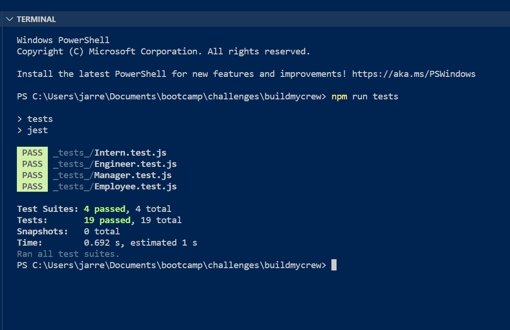

# Create My Crew


## Description

This app uses information to compile a pirate crew. Info about the crew includes id, office number, name, email, github user name and school. It uses the CLI and implements node.js, the inquirer and jest packages.

- [GitHub repo](https://github.com/codingjarrett/buildmycrew)

## Installation

- Inquirer package

```
npm i inquirer@8.2.4
```

- Jest package

```
npm i jest
```

## Usage

1. Open app in CLI by running node

```
node index.js
```

2. Add the first mate's info
3. Add a crewmate or shipwright from the menu
4. Upon completing your crew, click crew complete!
5. Console.log shows created html
6. In dist, find crew
7. HTML opens in browser
8. Click email to open email app
9. Click gitHub link to open gitHub profile in new browser tab


## Credits

- [Tailwind CSS Framework](https://tailwindcomponents.com/component/list-order-product)

## License

This app uses the MIT License. See the [MIT License](https://choosealicense.com/licenses/mit) for more info.

## Tests

- Use Jest in CLI

--npm run tests



## Questions

Any questions? Visit my [GitHub profile](http://github.com/codingjarrett)